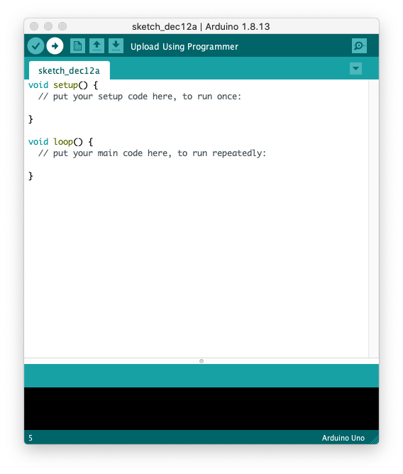

# Installing IDE for Mac OS

First, you will need to download `Arduino Integrated Development Environment (IDE)`. 

Go to https://www.arduino.cc/en/donate/ and select you OS. 

In my case, `Mac OS X`.

After download, `unzip` and open `Arduino.app`

<!--
TODO: the system will ask you to install Java runtime library if you don’t have it in your computer. ???
-->

