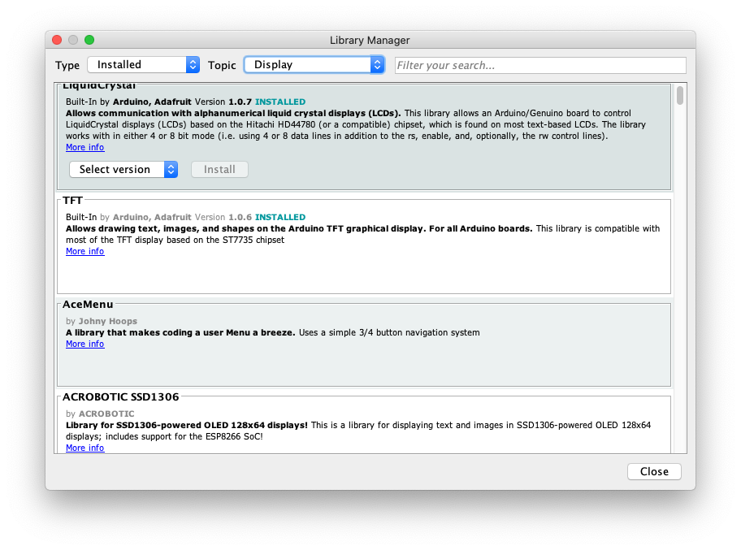

# Libraries

<!--

We can add libraries to extend functionality.

Libraries are a collection of code that makes it easy for you to connect to a sensor, display, module, etc. 

There are hundreds of additional libraries available on the Internet for download
-->

## Adding libraries

### Installing libraries

If you have the IDE version > 1.8.5, you can use the `Library Manager`

1. Go to `Sketch`
1. Select `Include Library`
1. Click on `Manage Libraries`

You should see libraries that you have installed and libraries that you can install, filtering by type (example, installed), topic (example: sensors) and searching by terms.

If you want to install one of the listed libraries, just pick the `version` and click on `install`

### Importing zip files

<!--
The name of the folder is the name of the library. Inside the folder will be a .cpp file, a .h file and often a keywords.txt file, examples folder, and other files required by the library. Starting with version 1.0.5, you can install 3rd party libraries in the IDE.
-->

1. Go to `Sketch`
1. Select `Include Library`
1. Choose your *.zip file

<!--
Return to the Sketch > Import Library menu. You should now see the library at the bottom of the drop-down menu. It is ready to be used in your sketch. The zip file will have been expanded in the libraries folder in your Arduino sketchesdirectory. NB: the Library will be available to use in sketches, but examples for the librarywill not be exposed in the File > Examples until after the IDE has restarted.
Those two are the most common approaches. MAC and Linux systems can be handled likewise. The manual installation to be introduced below as an alternative may be seldom used and users with no needs may skip it.
-->

### Manual installation